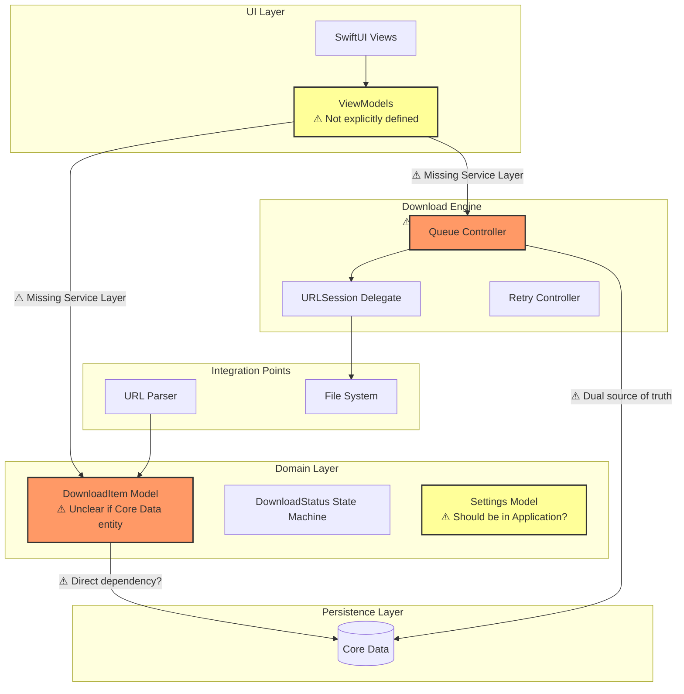
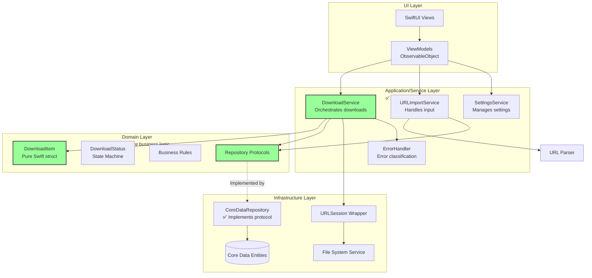
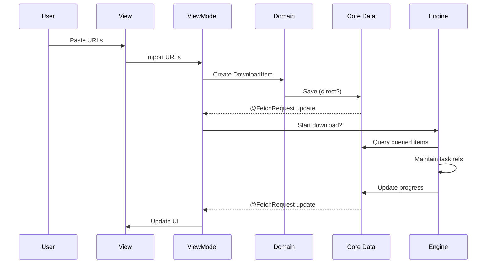
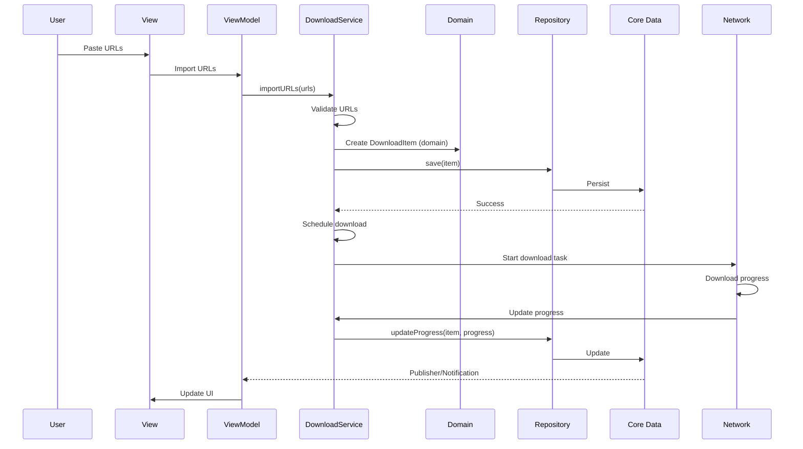

# Architecture Diagrams

## Current Architecture (Issues Highlighted)



**Issues Highlighted**:
- 🔴 Red: Critical architectural violations
- 🟡 Yellow: Missing or unclear components

---

## Recommended Architecture (Clean Architecture)



**Improvements**:
- ✅ Clear layer separation
- ✅ Dependency inversion (Domain defines interfaces)
- ✅ Single source of truth (Core Data)
- ✅ Testable layers

---

## Data Flow Comparison

### Current Data Flow (Problematic)

```
User Action
    ↓
View → ViewModel
    ↓
Domain Model (Core Data entity?)
    ↓
Core Data (persistence)
    ↓
Download Engine (queries Core Data)
    ↓
URLSession (updates Core Data)
    ↓
Core Data (triggers @FetchRequest)
    ↓
UI Update
```

**Issues**:
- ⚠️ Domain model might be Core Data entity (violation)
- ⚠️ Engine maintains separate state (dual source of truth)
- ⚠️ No orchestration layer

### Recommended Data Flow

```
User Action
    ↓
View → ViewModel
    ↓
Application Service (DownloadService)
    ↓
Domain Model (pure struct)
    ↓
Repository (interface)
    ↓
Core Data Repository (implementation)
    ↓
Core Data (persistence)
    ↓
Application Service (queries Repository)
    ↓
Domain Model (updated)
    ↓
Combine Publisher / Notification
    ↓
ViewModel (updates)
    ↓
View (renders)
```

**Benefits**:
- ✅ Clear separation
- ✅ Single source of truth
- ✅ Testable (mock repositories)
- ✅ Proper dependency direction

---

## Component Interaction Sequence

### Current (Problematic)



**Issues**:
- ⚠️ ViewModel directly accesses Domain/Persistence
- ⚠️ Engine maintains separate state
- ⚠️ No clear orchestration

### Recommended



**Benefits**:
- ✅ Clear service layer orchestration
- ✅ Repository abstraction
- ✅ Single source of truth
- ✅ Testable with mocks

---

## Dependency Graph

### Current Dependencies (Violations)

```
UI Layer
  ↓ depends on
Domain Layer (Core Data entities?)
  ↓ depends on
Persistence Layer (Core Data)
  ↑ VIOLATION: Domain depends on Infrastructure

Download Engine
  ↓ depends on
Persistence Layer (Core Data)
  ↓ maintains
In-Memory State
  ↑ VIOLATION: Dual source of truth
```

### Recommended Dependencies (Clean)

```
UI Layer
  ↓ depends on
Application Layer
  ↓ depends on
Domain Layer (defines interfaces)
  ↑ implemented by
Infrastructure Layer
```

**Dependency Rule**: Dependencies point inward toward Domain.

---

## State Management Comparison

### Current (Dual Source of Truth)

```
┌─────────────────┐         ┌─────────────────┐
│  Download Engine│         │   Core Data     │
│  (In-Memory)    │         │  (Persistent)   │
│                 │         │                 │
│  - Task refs    │◄──┐  ┌──│  - DownloadItem │
│  - Active state │   │  │  │  - Status       │
│  - Progress     │   │  │  │  - Progress     │
└─────────────────┘   │  │  └─────────────────┘
                      │  │
                      └──┴── SYNC ISSUES
```

**Problems**:
- What if engine crashes? State lost.
- What if Core Data save fails? Inconsistency.
- What if both updated simultaneously? Race condition.

### Recommended (Single Source of Truth)

```
┌─────────────────┐
│   Core Data     │
│  (Single Source)│
│                 │
│  - DownloadItem │
│  - Status       │
│  - Progress     │
└────────┬────────┘
         │
         │ queries
         ↓
┌─────────────────┐
│ Download Engine  │
│  (Stateless)     │
│                 │
│  - Reads from CD │
│  - Updates CD    │
│  - No local state│
└─────────────────┘
```

**Benefits**:
- ✅ Single source of truth
- ✅ No sync issues
- ✅ Crash recovery automatic
- ✅ Consistent state

---

## Layer Responsibilities Matrix

| Component | Current Location | Recommended Location | Rationale |
|-----------|------------------|---------------------|-----------|
| DownloadItem Model | Domain | Domain (pure) + Infrastructure (Core Data entity) | Separate domain from persistence |
| Queue Controller | Engine | Domain (business logic) | Business rule, not infrastructure |
| URLSession Wrapper | Engine | Infrastructure | Infrastructure concern |
| Retry Logic | Engine | Domain | Business rule |
| URL Parser | Integration Points | Application/Utilities | Application service |
| ViewModels | Not defined | UI Layer | Explicitly part of UI |
| Error Handler | Missing | Application Layer | Orchestration concern |
| Repository | Missing | Infrastructure (implements Domain protocol) | Abstraction needed |

---

## Migration Path

### Phase 1: Add Application Layer
1. Create `Application` folder
2. Add `DownloadService` (orchestrates engine + persistence)
3. Move orchestration logic from ViewModels to Services

### Phase 2: Separate Domain from Persistence
1. Create pure `DownloadItem` struct in Domain
2. Create `DownloadItemEntity` in Infrastructure (Core Data)
3. Add mapping between them

### Phase 3: Add Repository Pattern
1. Define `DownloadItemRepository` protocol in Domain
2. Implement `CoreDataDownloadItemRepository` in Infrastructure
3. Update services to use repository interface

### Phase 4: Remove Dual State
1. Remove in-memory state from Engine
2. Make Engine query Core Data for current state
3. Update Engine to be stateless

### Phase 5: Add Error Handling Infrastructure
1. Define error types in Domain
2. Create ErrorHandler in Application
3. Update services to use ErrorHandler

---

## Testing Architecture

### Current (Difficult to Test)

```
Tests
  ↓
Need full Core Data stack
  ↓
Need URLSession
  ↓
Tightly coupled
```

### Recommended (Testable)

```
Unit Tests
  ↓
Domain Layer (pure Swift, no dependencies)
  ↓
Mock Repository (implements protocol)
  ↓
Test business logic in isolation

Integration Tests
  ↓
Application Services
  ↓
Real Repository (Core Data)
  ↓
Test orchestration

UI Tests
  ↓
ViewModels
  ↓
Mock Services
  ↓
Test UI logic
```

**Benefits**:
- ✅ Fast unit tests (no Core Data)
- ✅ Isolated testing
- ✅ Easy mocking

